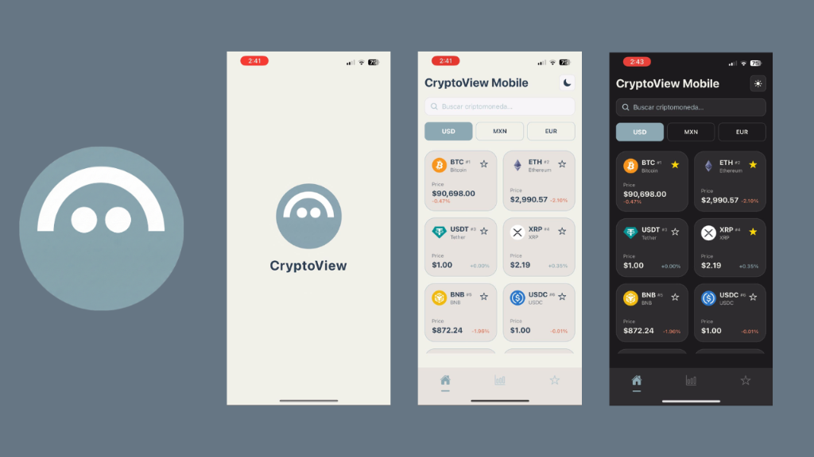

## Tecnologías


# CryptoView

CryptoView es una aplicación móvil para visualizar precios y estadísticas de criptomonedas en tiempo real.



## Funcionamiento


## Demo

Mira el funcionamiento de la aplicación en YouTube:
[](https://youtube.com/shorts/aD0DPj_sKTE?si=hMADfADLxBG4TWVQ)

## Características (Features)

*   **Modo Oscuro/Claro**: Adaptable a las preferencias del sistema o del usuario.
*   **Conversión de Divisas**: Visualiza precios en USD, MXN y EUR.
*   **Gráficos Interactivos**: Gráficos de línea para ver la tendencia de precios (24h, 7d, 30d).
*   **Favoritos**: Guarda tus criptomonedas preferidas para un acceso rápido.
*   **Búsqueda**: Encuentra fácilmente cualquier criptomoneda.
*   **Datos en Tiempo Real**: Información actualizada gracias a la API de CoinGecko.

## Configuración (Environment Variables)

Para evitar límites en las peticiones a la API, es necesario configurar una API Key de CoinGecko.

1.  Crea un archivo `.env` en la raíz del proyecto.
2.  Agrega tu clave de API:

    ```env
    EXPO_PUBLIC_COINGECKO_API_KEY=tu_api_key_aqui
    ```

## Estructura del Proyecto

```
cryptoapp/
├── app/                 # Rutas y pantallas de la aplicación (Expo Router)
├── components/          # Componentes reutilizables de UI
├── context/             # Estado global (Context API)
├── hooks/               # Custom Hooks para lógica reutilizable
├── utils/               # Funciones de utilidad y helpers
├── constants/           # Constantes y configuración de tema
└── assets/              # Imágenes y fuentes
```

## Instalación (APK)

Si deseas probar la aplicación directamente en un dispositivo Android sin instalar el entorno de desarrollo, puedes usar el archivo APK incluido en este repositorio.

*   **Ubicación**: `ejecutable-android/cryptoviewapp.apk`
*   **Instrucciones**: Transfiere el archivo a tu dispositivo Android e instálalo (asegúrate de permitir la instalación desde orígenes desconocidos).

## Cómo probar el proyecto

Sigue estos pasos para ejecutar la aplicación:

1.  **Instalar dependencias**

    ```bash
    npm install
    ```

2.  **Iniciar la aplicación**

    ```bash
    npx expo start
    ```
